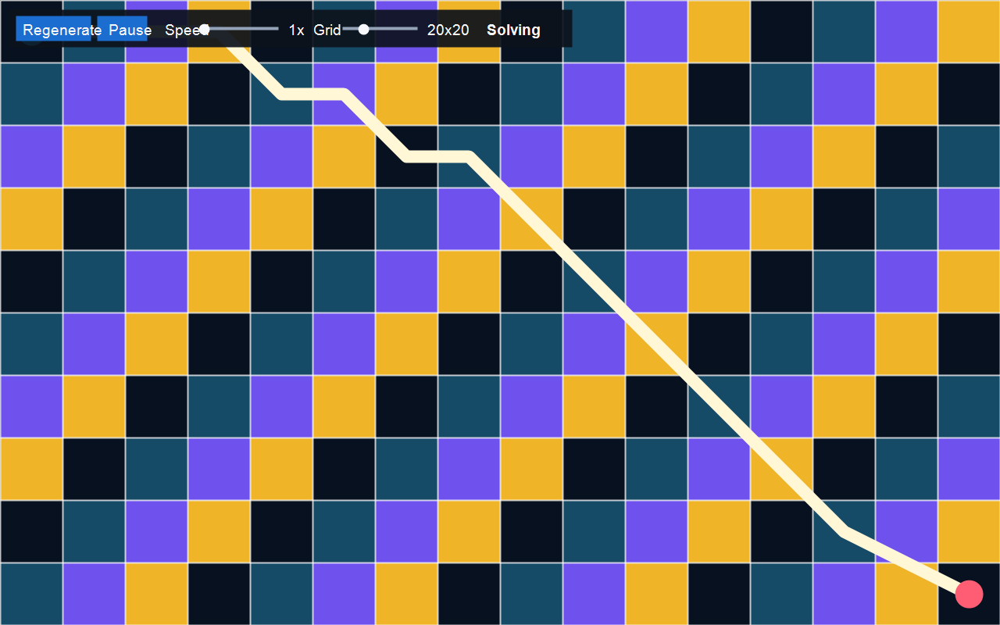

# Maze Solver

An interactive browser visualizer for maze generation and pathfinding. The app builds a maze with recursive backtracking, then solves it with A* while showing the generator state, explored cells, final path, start cell, and goal cell.



## Live Demo

[Open the live demo](https://leitnerdominik.github.io/Maze-solver/)

## Features

- Recursive backtracking maze generation
- A* pathfinding visualization
- Distinct colors for visited cells, explored A* cells, start, goal, and final path
- Controls for regenerating the maze, pausing playback, changing speed, and changing grid size
- Static deployment with no backend or build step required for the app itself

## Controls

- `Regenerate`: creates a fresh maze.
- `Pause` / `Play`: stops and resumes the current visualization without resetting it.
- `Speed`: changes how many algorithm steps run per animation frame.
- `Grid`: changes the maze size and starts a new run.
- `Status`: shows whether the app is generating, solving, solved, paused, or has no solution.

## How It Works

Recursive backtracking starts at the first cell, repeatedly visits a random unvisited neighbor, removes the wall between the cells, and backtracks when it reaches a dead end. This creates a connected maze with a clear generation animation.

A* searches from the start cell to the goal cell using Manhattan distance as its heuristic. The app exposes the open set, closed set, current cell, and final path so the search can be inspected and visualized.

## Local Development

Install dependencies once:

```sh
npm install
```

Run the local static server:

```sh
npm run dev
```

Then open `http://localhost:8000`.

Useful checks:

```sh
npm test
npm run format:check
```

## What This Project Demonstrates

- Canvas-based animation with p5.js
- Algorithm visualization and state management
- Small, dependency-light frontend tooling
- Focused tests for core maze and pathfinding behavior
- Static-site deployment suitable for a portfolio project
